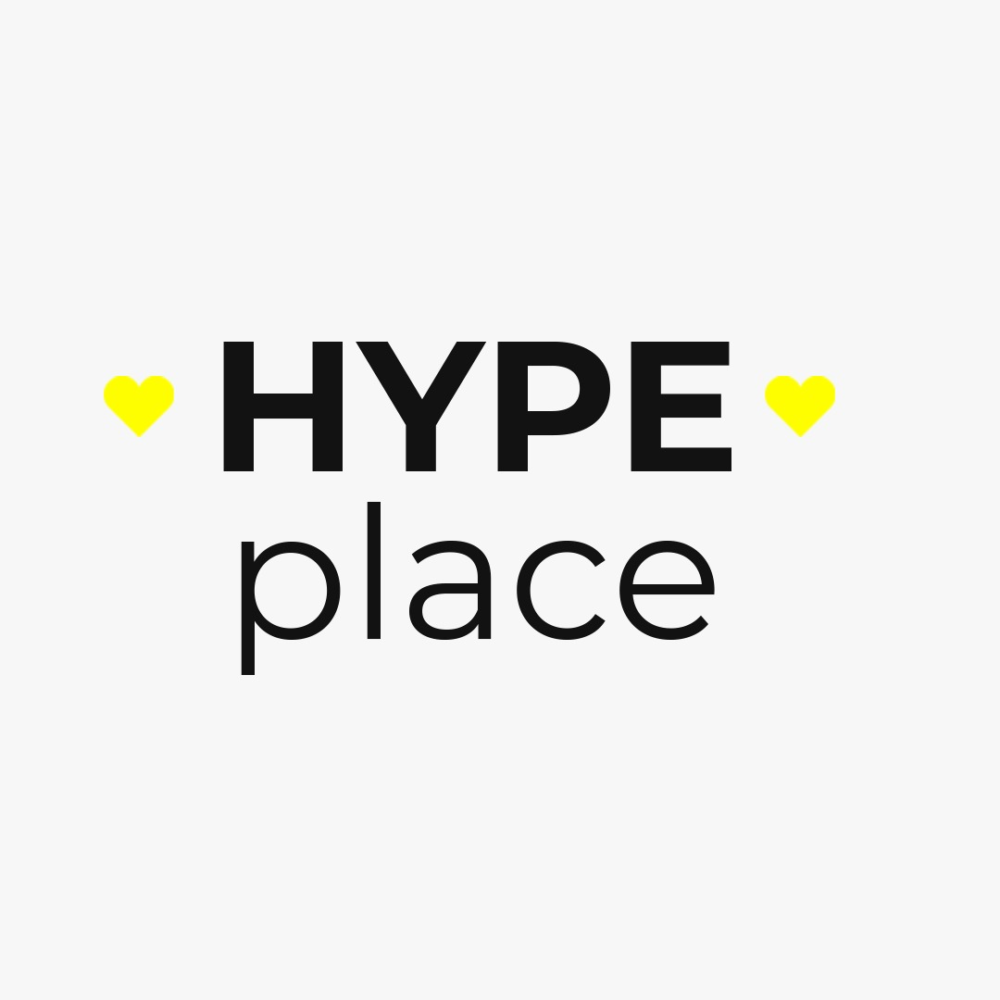
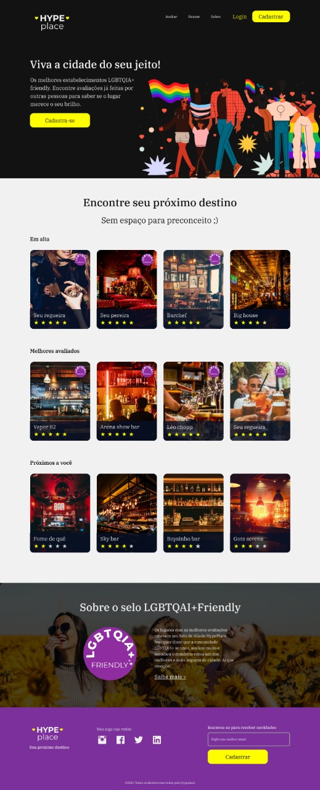
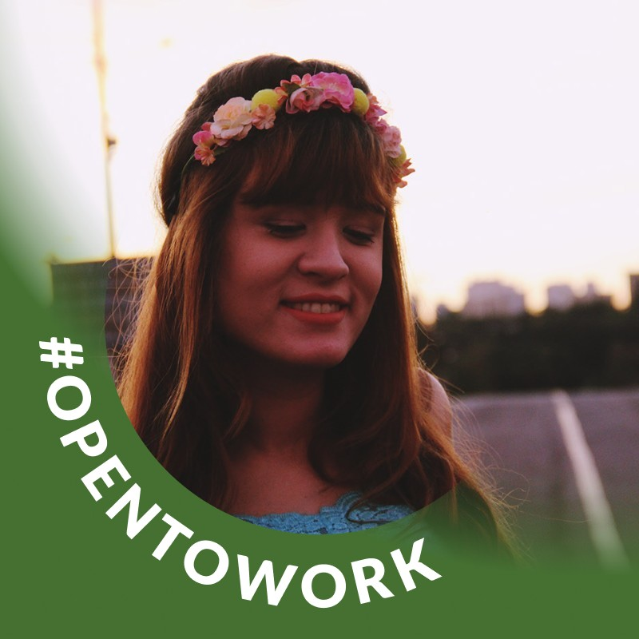
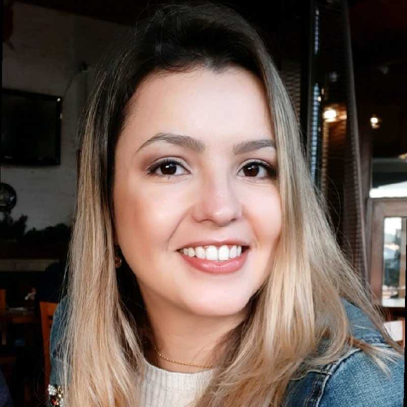
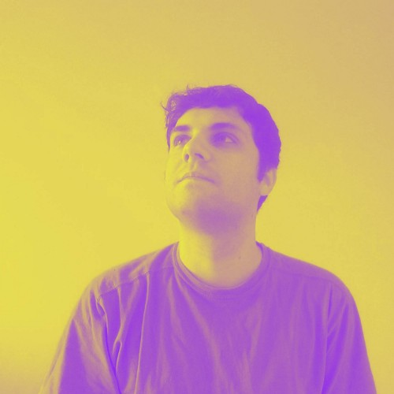

 <h1> Hype Place </h1> 

<a href = "https://hypeplace.netlify.app/">Deploy da aplicação</a>

<a href = "https://ecomercegenbr.herokuapp.com/swagger-ui">Deploy do Back-end</a>

 

## SOBRE O PROJETO

 HypePlace é um site de avaliações de bares, restaurantes e baladas, focado no público LGBTQIA+.

## LAYOUT

O layout da aplicação: 

##

## DESENVOLVEDORES

Um grande agradecimento a este grupo incrível! =D

<table>
  <tr>
    <td align="center"><a href="https://www.linkedin.com/in/brendalelis94/"> <b>Brenda Lelis</b></a> &nbsp</td>
    <td align="center"><a href="https://www.linkedin.com/in/catiacananea/"> <b>CatCatia Cananea</b></a> &nbsp</td>
    <td align="center"><a href="https://www.linkedin.com/in/juliocesar2811/"> <b>Julio Cesar Martins</b></a> &nbsp</td>
    <td align="center"><a href="https://www.linkedin.com/in/igortudisco/"> <b>Igor Tudisco</b></a> &nbsp</td>
    <td align="center"><a href="https://www.linkedin.com/in/viniciuslmiguel/"> <b>Vinicius Miguel</b></a> &nbsp</td>   
  </tr>
</table>

##

## Mentor

Muito obrigado pelos os seus ensinamentos! =D

<table>
  <tr>
    <td align="center"><a href="https://www.linkedin.com/in/queiroz-rodrigo/"> <b>Rodrigo Alcydes de Queiroz</b></a> &nbsp</td>   
  </tr>
</table>
